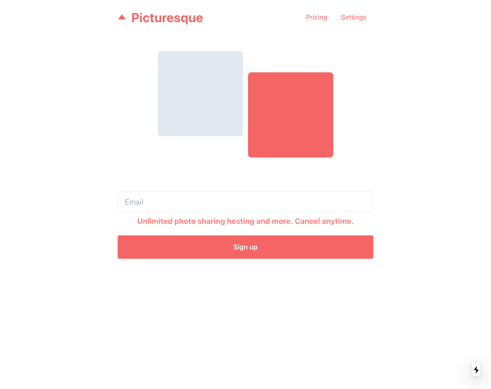
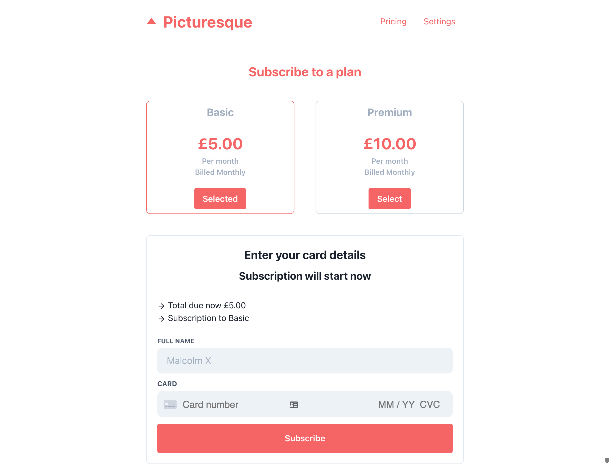
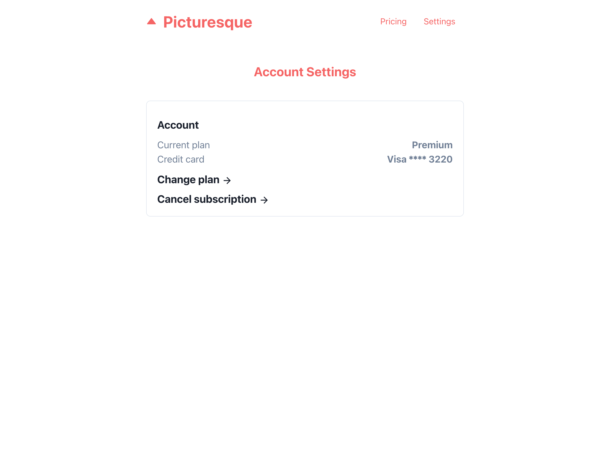

# Complete Stripe Subscriptions

Picturesque is a complete subscription producrt based on Stripe's fictional product to demonstrate its billing/subscription platform. 

## Usage
Firstly, ensure you have a Stripe account. Once you have an account, go the customer section and create a customer. Please create a .env file in the root of the project and add the follow variables

```bash
  STRIPE_SECRET_KEY=
  NEXT_PUBLIC_STRIPE_PUB_KEY=
  NEXT_PUBLIC_CUSTOMER_ID=
```

## Installation

`npm install or yarn`


## Run 
`npm start or yarn start`

## Features
- Create/Sign up a customer 
- Subscribe to a subscription
- Delete subscription
- Retriece Customer and Card details
- Global store with react-hooks
- Retrieve subscription details
- Stripe intregration plus handling SCA 3d Secure cards
- Beautiful UI made with Chakra UI


## Stack
- Next.js
- Chakra UI
- Axios
- Stripe 


## Todo 
- [ ] Fix UI Issue where form persists on multiple pages
- [ ] Fix updating subscription properly
- [ ] Implement webhook


## Screenshots

*Home*


*Plans*


*Settings*

